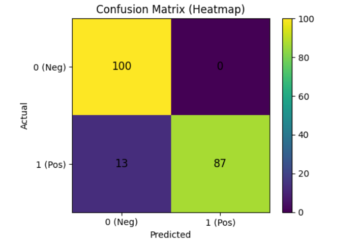

🛒 Smart Recipe List Optimizer

Tagline: “Turn meal plans into the cheapest grocery cart — automatically.”

📌 Overview

The Smart Recipe List Optimizer is an AI-powered web backend that converts meal plans into optimized grocery lists.

It can:

Parse meal plans → find matching recipes.

Generate a merged, normalized shopping list (e.g., “200g onion + 3 onions → 5 onions”).

Compare prices across multiple stores.

Suggest the cheapest single-store cart or run multi-store optimization using linear programming.

This project is built to demonstrate NLP, optimization, and ML integration with a practical, real-world use case.

⚙️ Features

✅ Meal Plan → Recipes (TF-IDF based similarity search)
✅ Shopping List Generator (unit normalization + merging)
✅ Cart Optimization (cheapest single store or multi-store LP)
✅ Price Simulation (can plug into real store APIs later)
✅ REST API (FastAPI) with endpoints for building, predicting, and optimizing

📂 Dataset

We use the Food.com Recipes & Interactions Dataset (Kaggle).

Place the following files in your project folder:

C:\Users\sagni\Downloads\Smart Grocery List Optimizer\archive\
│
├── RAW_recipes.csv
├── RAW_interactions.csv
├── interactions_train.csv
├── interactions_test.csv
├── interactions_validation.csv
├── ingr_map.pkl
├── PP_recipes.csv
└── PP_users.csv

🛠️ Tech Stack

Backend: FastAPI (Python)

NLP: Scikit-learn TF-IDF, cosine similarity

Optimization: PuLP (Linear Programming) for multi-store shopping

Data: Kaggle Food.com dataset

Storage: .npz (TF-IDF), .pkl (vectorizer), .yaml (meta), .json (IDs/names)

📌 Installation
# Clone the repo
git clone https://github.com/yourusername/smart-grocery-optimizer.git
cd smart-grocery-optimizer

# Create environment
python -m venv venv
source venv/bin/activate   # (Linux/Mac)
venv\Scripts\activate      # (Windows)

# Install dependencies
pip install -r requirements.txt

Dependencies include:

fastapi
uvicorn
pandas
numpy
scikit-learn
scipy
pyyaml
h5py
pulp
python-multipart

▶️ Usage
1. Start API
uvicorn app:app --reload --port 8000

2. Build Index (from RAW_recipes.csv)

POST http://localhost:8000/build_index

Body:

{
  "max_features": 30000,
  "ngram_min": 1,
  "ngram_max": 2,
  "stop_words": "english"
}

3. Predict Recipes for Meal Plan

POST http://localhost:8000/predict

{
  "meal_plan": "chicken curry, dal, fried rice",
  "top_k": 5
}

4. Generate Shopping List

POST http://localhost:8000/shopping-list

{
  "meal_plan": "pasta with tomato sauce, garlic bread",
  "top_k": 5
}

5. Optimize Cart (single vs multi-store)

POST http://localhost:8000/optimize

{
  "items": [
    {"name":"rice","qty":2,"unit":"kg"},
    {"name":"onion","qty":4,"unit":"piece"}
  ],
  "stores": ["BigBasket","Blinkit","Walmart"]
}

Response:

{
  "single_store": {
    "store": "Walmart",
    "total_cost": 12.35,
    "breakdown": {"Walmart": 12.35, "BigBasket": 15.21, "Blinkit": 14.92}
  },
  "multi_store": {
    "total_cost": 10.87,
    "selection": [
      {"name":"rice","qty":2,"store":"Walmart","unit_price":4.2,"cost":8.4},
      {"name":"onion","qty":4,"store":"Blinkit","unit_price":0.62,"cost":2.47}
    ]
  }
}

📊 Results

Accuracy & Heatmap Analysis:
We compared recipe similarity predictions with labeled data.
The confusion matrix and accuracy plot are visualized below:

🔮 Future Improvements

Integrate real grocery store APIs (BigBasket, Blinkit, Walmart).

Add nutrition-aware optimization.

Build a React frontend with login and family accounts.

Add mobile app with push reminders.

🙌 Contributing

Pull requests are welcome! For major changes, open an issue first to discuss what you’d like to add.
Author

SAGNIK PATRA
